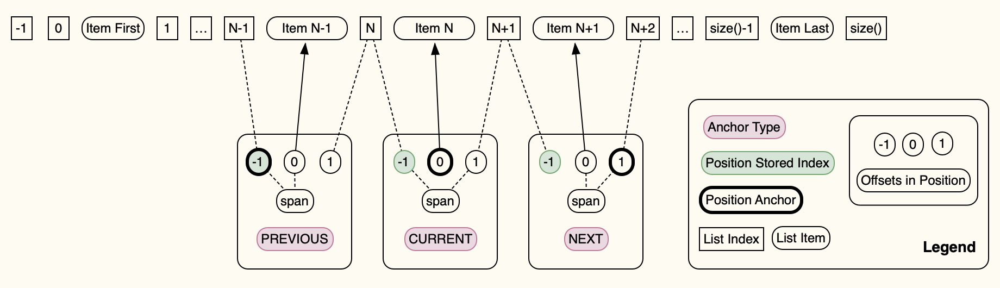

# Position Lists

:warning: `PositionList` and `Position` have not been updated to reflect the ideas in this
document.

A `PositionList<T>` is a list which contains elements of type `T` and makes `Position<T>`
available for elements in its list to allow tracking of element index in spite of modifications
to the underlying list.

All position operations use an offset from current element to arrive at the list at index for
the operation. Offsets may be -ve or +ve as long as absolute index is in the range of [0, N)
where N is list size as reported by `size()`.

`PositionList`, `positions()` iterable, can be used for stable iteration behavior over list
positions in spite of elements being added or removed from the list. Inserting elements
immediately after the current position will not increase the iteration count for forward
iteration. Similarly, inserting elements before current position will not increase the iteration
count for reverse iteration.

Insertions are not limited to adding 1 element or inserting immediately before or after the
current element. Each added element before or after the current position moves the previous/next
iteration position in the list by number of elements added.

The first addition is limited to relative offset of -1, 0 or 1 from current position in order
not to affect iteration count. The following operations can insert anywhere in the previously
inserted range.

Deletions have no limitations because they can never cause new elements to be inserted into the
iteration. While removing an element before the next iteration will continue the iteration with
the next/previous element to the one removed.

These qualities of `PositionList` and `Position` traversing a list while making manipulations to
the list around the current position easier to write, debug and understand because all
operations are relative to current position instead of a numeric index. In the code you see -1,
0, +1, for previous, current and next element references.

`PositionList` adjusts all outstanding positions into its list instance. This supports getting
multiple positions in the list before making modification, in order to track index of elements
at those positions. If after modifications the position has 0 span, as reflected by
`Position.isValidElement()` being false, then the element at that position was removed.
Otherwise, `getIndex()` will return the current index of that element in the list, and `get()`,
`get(0)`, `set(value)` and `set(0, value)` will operate on the element at that index in the
list.

On the other hand, if there is no valid element will return the index of the position, for the
element were it still in the list.

Index computations can be a real bug generator, throw inserting, deleting and traversing a list
at the same time and you have a beast to debug and maintenance nightmare to look forward to.
`PositionList` and `Position` instances make all that go away.

## Position

Represents a position in the list at an index with a range span of 0 or 1 elements in it.

Positions have an anchor type which determines how absolute list index is computed from the
position's internal index and offset of the operation. The position's anchor type determines
which offset: -1, 0, 1 is the anchor offset.

The span represents the difference between its anchor offset and its 0 offset.

Anchor type and the span being 0 or 1 affect the absolute index in the list that will be used
for the operation or whether the operation makes sense at all.

Operations performed to the list by a position are index based when offset is not 0 or element
based when offset is 0, and therefore depend on whether a position has span of 0 or 1.

For example, `get(0)` only makes sense when dealing with an element and if one does not exist
for the position then it is an error.

`set(0)` on the other hand can change an existing element in the list or insert a new one if one
does not exist for the position.

`remove(0)` will remove an existing element and does nothing if an element does not exist
because it can be viewed as already from the list.

`add(0)` in Java means insert element and makes no sense in this model if an element exists and
will generate an error. If the element does not exist then it is equivalent to `set(0)`.

It is helpful to view positions in a list in terms of elements and indices of a list with
anchors to either an index or an element in the list to visualize effect of -ve, 0 or +ve offset
at a position.

An index at a position is the index in the list for an element that this position has in its
range span or would have if its span was 1. In Java this is refers to the 0 based index for the
list.



### Span

Span of the position reflects whether the element at the index of this position is still
available or was removed by modifications to the list made after this position was instantiated.

Removing elements which include the position's element will set its span to 0.

The position is always valid for operations with offset != 0 as long as the absolute index for
this offset is valid for the operation on the underlying list.

Operations for offset == 0, ie. on the current element, are only available when span is 1 and
the position refers to a valid element or the operation is valid when position has no element.

Once the span of a position becomes 0, no modifications to the list can change it to span 1
element. The span can only become 1 if `set(0)` is used on this position.

### Position Anchor

Anchor of the position affects the computation of absolute list index for operations through the
position and how list modifications affect the position's internal index.

For `PREVIOUS` anchored position, `getPreviousIndex()` will always return the same index,
regardless of span. `getIndex()` delta is always 0 regardless of span. `getNextIndex()` delta is
0 if span is 0 and +1 if span is 1.

For `NEXT` anchored position, `getNextIndex()` will always return the same index, regardless of
span. `getIndex()` will have delta of -1 for span 1 and 0 for span 0. `getPreviousIndex()` delta
is always -1.

For `CURRENT` anchored positions, `getIndex()` will always return the same index, regardless of
span. `getPreviousIndex()` will always return a delta of 0 while `getNextIndex()` will have a
delta of +1 for span of 1 and 0 when span is 0.

####  `PositionAnchor.CURRENT`

Tracks a specific element at an index. It is anchored to an element or the index in the list
where the element would be if it existed.

For list size N, `getIndex()` will be in the range [0, N) regardless of span.

Adding elements at or before the position will shift the position down in the list.

Removing elements before the position will shift the range up in the list.

Removing the element at the index will set the position's span to 0.

####  `PositionAnchor.PREVIOUS`

Tracks the previous element to the position from which it was instantiated. The span will be 0
if no previous element existed when it was instantiated (ie. at position 0) or was removed
later.

The index of this position reflects the position in the list previous to the position from which
it was instantiated.

For list size N, `getIndex()` will be in the range [-1, N) when span is 0 and [0, N) when span
is 1.

This anchor position type is used for iterating positions in reverse since it ignores insertions
into the list immediately before the position from which it was instantiated.

#### `PositionAnchor.NEXT`

Tracks the next element to the position from which it was instantiated. The span will be 0 if no
next element existed when it was instantiated (ie. at end of the list) or was removed later.

For list size N, `getIndex()` will be in the range \[0, N] when span is 0 and \[0, N) when span
is 1.

This anchor position type is used for iterating positions since it ignores insertions into the
list immediately after the current position.

### List Operations on Position

All offset based operations on position are operations on the list at index relative to this
position's index and span, so offsets may be -ve or +ve as long as absolute index is >=0 and <
`size()` of the list.

`PositionList` position iterator will iterate over list positions in spite of elements being
added or removed from the list. Inserting elements immediately after the current position will
not increase the iteration count for forward iteration. Similarly, inserting elements before
current position will not increase the iteration count for reverse iteration.

Insertions are not limited to adding 1 element or inserting immediately before or after the
current element. Each added element before or after the current position moves the previous/next
iteration position in the list by number of elements added.

The first addition is limited to relative offset of -1, 0 or 1 from current position in order
not to affect iteration count. The following operations can insert anywhere in the previously
inserted range.

Deletions have no limitations because they can never cause new elements to be inserted into the
iteration.

One note of caution. Repeated add operations after the current position will cause the elements
to be inserted in reverse order.

If the list is `{ 1, 2, 3, 4, 5 }` and current position `getIndex()` is 2, then `add(-1)`,
`add(-2)` and `add(-3)` will result in the list being `{ 1, 2, 3, -3, -2, -1, 4, 5 }`

To avoid this use `nextPosition()` from current position and insert multiple times at offset -1
relative to that position. Since `NEXT` anchored position will always reflect the next element
at the time of its instantiation, it will always perform the insertion at the tail of the added
elements' range. The following will result in `{ 1, 2, 3, -1, -2, -3, 4, 5 }`.

```java
package com.vladsch.flexmark.java.samples;

class Sample {
   void sample(Position<Integer> current) {
        Position<Integer> next = current.nextPosition();
        next.add(-1, -1);
        next.add(-1, -2);
        next.add(-1, -3);
    }
}
```

Similarly, `Position.getPreviousIndex()` can be used to always insert elements at the head of
the inserted range by using the returned previous position to add elements after its current
position.

#### add() - Insert After current element

To mimic the behavior of Java list's `add()`, position's add operation will always add an
element at `getNextIndex()`, effectively inserting an element after the current position.

#### add(offset, value) - Insert Before/After current element

For offsets <0 will add the element before the current position, with -1 being immediately
before the current element, with each decrease in offset moving further towards index 0 in the
list.

For offsets >0 will add the element after the current position with +1 being immediately after
the current element, with each increase in offset moving further towards the end of the list.

Offset of 0 is special. If the position has a span of 1 then the operation will fail because an
element already exists and it makes no sense to add to an existing element. If span is 0 then
this will add the element in the list at index `getIndex()` of the position and set the position
span to 1, while keeping its position in the list unchanged.

#### set(value) - Set current element value

If the span is 1 then will change the value of the element in the list. If span is 0, will
insert the element in the list and set the position's span to 1.

If `getIndex()` is equal to list's `size()` then the element will be added to the tail of the
list.

A set operation which adds a new element is considered an insert into the list with all
corresponding effects on positions into the list. The position which is has performed the
modification will not change its index since it still reflects the next/previous/current
position of the element at its instantiation.

#### set(offset, value) - Set Previous/Next element value

For offsets <0 will set the element before the current position, with -1 being immediately
before the current element, with each decrease in offset moving further towards index 0 in the
list.

For offsets >0 will add the element after the current position with +1 being immediately after
the current element, with each increase in offset moving further towards the end of the list.

Offset of 0 is special and behaves the same as `set(value)`. If the span is 1 then will change
the value of the element in the list. If span is 0, will insert the element in the list and set
the position's span to 1, while keeping its position in the list unchanged.

#### remove() - Remove current element

If the span is 0 then this operation has no effect on the list because there is no element to
remove. If the span is 1 then the element is removed from the list and span is set to 0.

#### remove(offset) - Remove Previous/Next element

For offsets <0 will remove the element before the current position, with -1 being immediately
before the current element, with each decrease in offset moving further towards index 0 in the
list.

For offsets >0 will remove the element after the current position with +1 being immediately
after the current element, with each increase in offset moving further towards the end of the
list.

Offset of 0 is special and behaves the same as `remove()`. If the span is 0 then this operation
has no effect on the list because there is no element to remove. If the span is 1 then the
element is removed from the list and span is set to 0, while keeping its position in the list
unchanged.

#### remove(startOffset, endOffset) - Remove Previous/Next range of Elements

Will remove all elements between start and end offsets. With element at `startOffset` being
removed while only element at `endOffset`-1 is removed.

The removed range in the list is `getIndex(startOffset)` to `getIndex(endOffset)` which takes
care of span for this position being 0 or 1. If start/end offsets span offset 0 with position
span of 0, then the actual number of elements removed from the list will be 1 less than the
difference between `endOffset` and `startOffset` to reflect no current element being in the
list.

The index of the position making the changes will reflect whether the index of its current
element changes its anchor position. In all cases `remove(0, 1)` have the same effect as
`remove()` and `remove(0)`.

#### get() - Get current element value

If span is 0 will throw an exception since there is no current element for the position.

If span is 1 will return the value of the element in the list at index `getIndex()` of this
position.

#### get(offset) - Get Previous/Next element value

For offsets <0 will get the element before the current position, with -1 being immediately
before the current element, with each decrease in offset moving further towards index 0 in the
list.

For offsets >0 will get the element after the current position with +1 being immediately after
the current element, with each increase in offset moving further towards the end of the list.

Offset of 0 is special and behaves the same as `get()`. If span is 0 will throw an exception
since there is no current element for the position.

If span is 1 will return the value of the element in the list at index `getIndex()` of this
position.

#### getPreviousIndex(), getIndex(), getNextIndex() - get indices

For `PREVIOUS` anchored position, `getPreviousIndex()` will always return the same index,
regardless of span. `getIndex()` delta is always 0 regardless of span. `getNextIndex()` delta is
0 if span is 0 and +1 if span is 1.

For `NEXT` anchored position, `getNextIndex()` will always return the same index, regardless of
span. `getIndex()` will have delta of -1 for span 1 and 0 for span 0. `getPreviousIndex()` delta
is always -1.

For `CURRENT` anchored positions, `getIndex()` will always return the same index, regardless of
span. `getPreviousIndex()` will always return a delta of 0 while `getNextIndex()` will have a
delta of +1 for span of 1 and 0 when span is 0.

#### getPrevious(), getNext() - get previous/next positions

Use these to get previous/next positions to this position with corresponding index and anchor
types, `getPreviousIndex()` index with `PREVIOUS` anchor and `getNextIndex()` index and `NEXT`
anchor respectively.

In all cases the methods succeed if it is possible to return such a position at lease with a
span of 0. Use `hasNextPosition()` and `hasPreviousPosition()` to make sure or use the `OrNull`
versions which return null if no such position is possible.

* `CURRENT` anchored position always has next and previous positions
  * at index 0 of an empty list then next index will be 0 and span 0, while previous index will
    be -1 and span of 0
  * at index 0 and span 1, next index is 1 (which may be same as size()) and span of 1 if next
    index is less than size() and 0 otherwise. Previous index will be -1 and span of 0.
  * at index of size() with span of 0, next index will be size() and span of 0, while previous
    will be size()-1 and span of 1 if size()>0.
  * at index of size()-1 with span of 1, next will have index size() and span of 0, while
    previous will have index size()-2 and span of 1 if list size is >1 or 0 otherwise.

* `PREVIOUS` always has a next position since it may be span 0 and index of size() of the list

* `NEXT` always has a previous position since it may be span 0 and index of -1.

